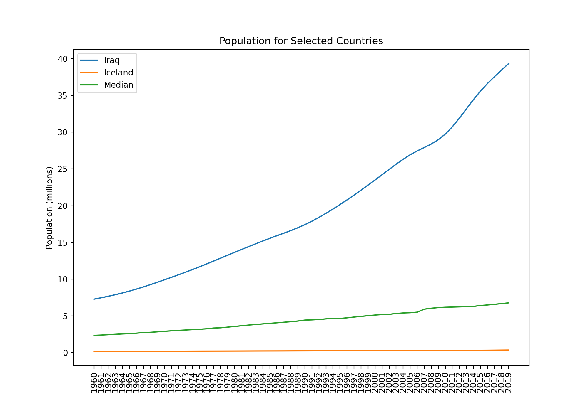
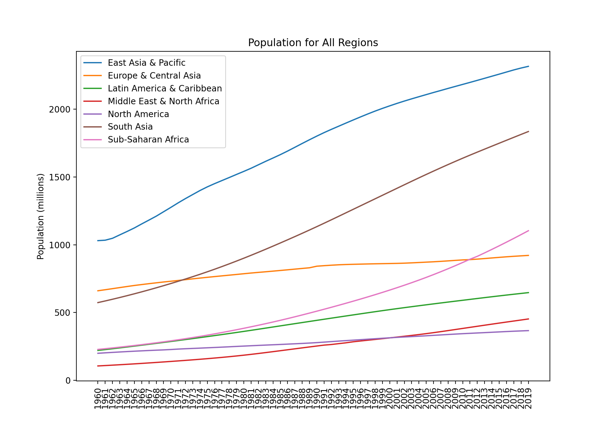
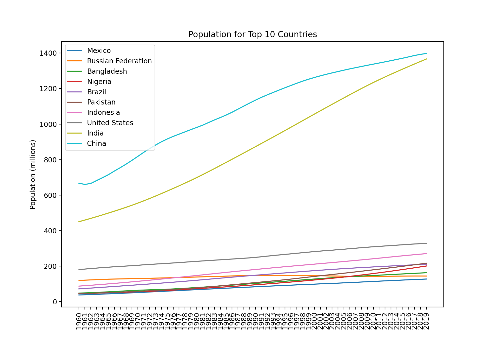
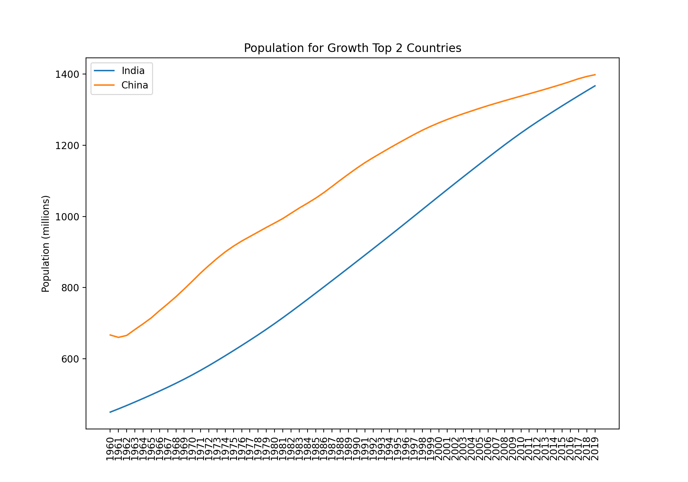
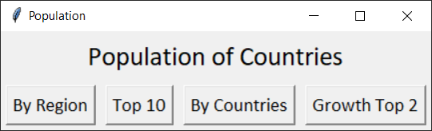
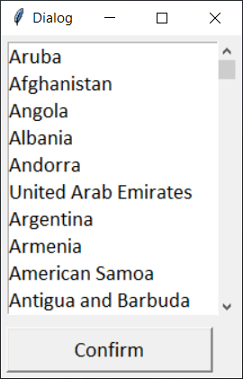
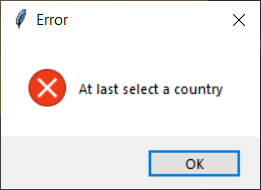
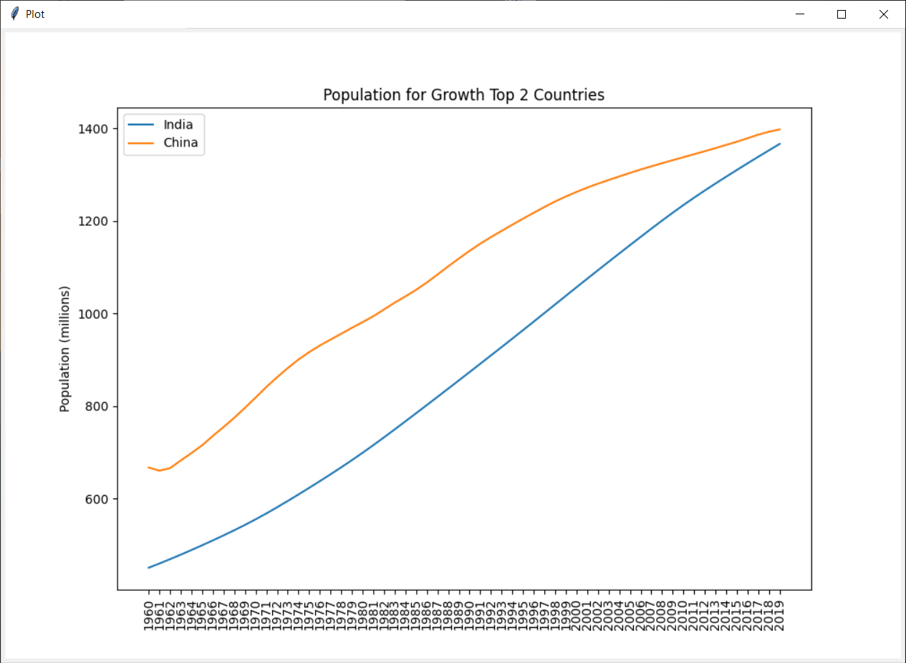

# Lab2 Data Analysis and GUI

The demands of this project please refer "references/lab2.docx".

## Folder Structure

```shell
Lab2 Data Analysis and GUI
├── figure
│   ├── gtop2.png
│   ├── regions.png
│   ├── selected.png
│   └── top10.png
├── lab2.py
├── population.py
├── README.md
├── references
│   ├── countries.csv
│   ├── lab2.docx
│   ├── population.csv
│   └── years.csv
└── requirements.txt
```

## Develop environment

* Python 3.8.5

### Setup

Run the command:

```shell
pip install -r requirements.txt
```

## population.py

Run Command

```shell
python population.py
```

Output:

```shell
East Asia & Pacific, Europe & Central Asia, Latin America & Caribbean, Middle East & North Africa, North America, South Asia, Sub-Saharan Africa
Mexico, Russian Federation, Bangladesh, Nigeria, Brazil, Pakistan, Indonesia, United States, India, China
India, China
```

Figure:






## lab2.py

Run Command

```shell
python lab2.py
```

Screenshot: 




